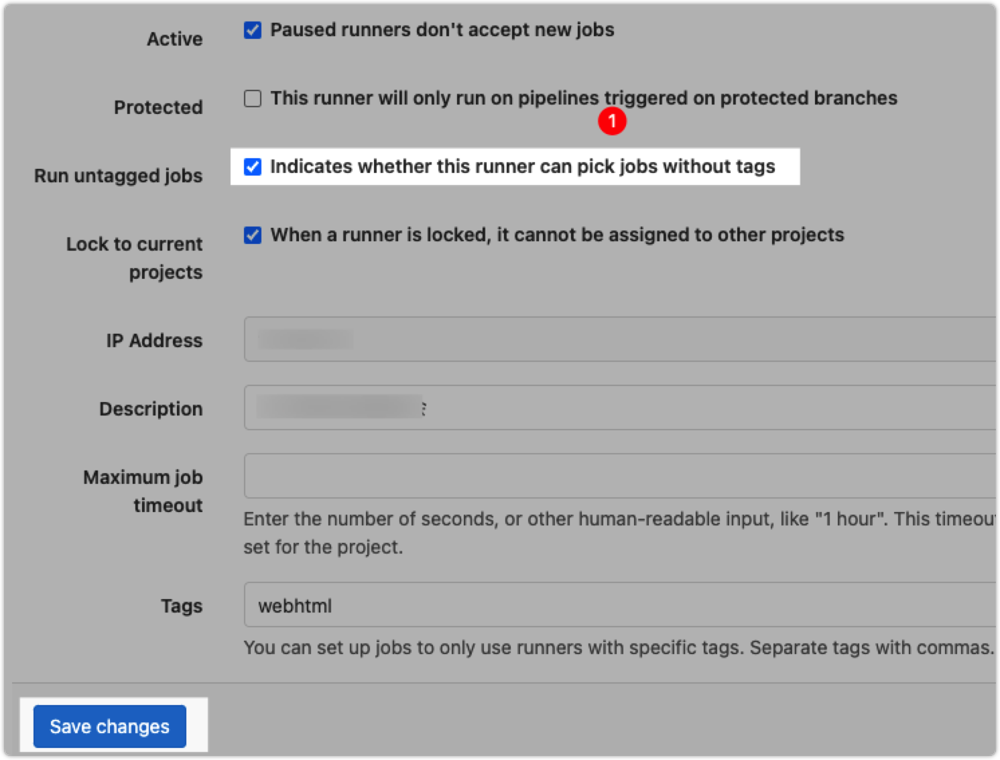

Docker 部署 Gitlab
===

在 Docker 中安装 Gitlab 教程，[官方文档](https://docs.gitlab.com/omnibus/docker/)，如果你想使用原生安装，教程在这里：[CentOS7安装维护Gitlab](https://github.com/jaywcjlove/handbook/blob/9adc40d9e684928ee68d3301afbd78eee7fe3816/CentOS/CentOS7%E5%AE%89%E8%A3%85%E7%BB%B4%E6%8A%A4Gitlab.md)

## 下载镜像

```bash
docker pull gitlab/gitlab-ce
```

## 运行容器

```bash
sudo docker run \
  --hostname gitlab.example.com \
  --publish 8443:443 --publish 8081:80 -p 2222:22 \
  --name gitlab \
  --restart always \
  --volume $HOME/_docker/gitlab/config:/etc/gitlab \
  --volume $HOME/_docker/gitlab/logs:/var/log/gitlab \
  --volume $HOME/_docker/gitlab/data:/var/opt/gitlab \
  -v /etc/localtime:/etc/localtime \
  -d \
  gitlab/gitlab-ce:latest
```

由于端口冲突，重新映射了一个端口 `2222`，如果不想麻烦，可以事先将 ssh 端口号更改成别的端口号，[修改ssh端口号的方法](https://github.com/jaywcjlove/handbook/blob/9adc40d9e684928ee68d3301afbd78eee7fe3816/CentOS/%E4%BF%AE%E6%94%B9ssh%E7%AB%AF%E5%8F%A3%E5%8F%B7%E7%9A%84%E6%96%B9%E6%B3%95.md)

```bash
# 要从之前的：
git clone git@gitlab.example.com:myuser/awesome-project.git
# 改为明确使用 `ssh://` 的 `URL` 方式。
git clone ssh://git@gitlab.example.com:2222/myuser/awesome-project.git
```

为了克隆不必麻烦，保留 `gitlab` 的 `22` 端口映射，将主机的 `sshd` 的 `22` 端口映射到容器中去。将主机的 sshd 端口更改为 `2222`

编辑文件 `/etc/ssh/sshd_config`，将其中的 `#Port 22` 注释去掉，将数字 `22` 更改为 `2222`，执行下面的命令重启 `sshd` 服务

```bash
systemctl restart sshd
```

防火墙的规则，添加开发 `2222` 端口

```bash
iptables -A INPUT -p tcp --dport 2222 -j ACCEPT
iptables -A OUTPUT -p tcp --sport 2222 -j ACCEPT
# 再查看下是否添加上去, 看到添加了
iptables -L -n
```

如果此容器由于权限问题而无法启动，请尝试通过执行以下操作来修复它：

```bash
docker exec -it gitlab update-permissions
docker restart gitlab
```

## 容器手动备份

```bash
# 第一种进行入容器执行命令的方法进行手工备份
docker exec -it 容器名或容器id bash  # 进入容器
gitlab-rake gitlab:backup:create   # 执行gitlab备份命令

# 第二种直接使用外部命令执行，一次完成
docker exec 容器名或容器id gitlab-rake gitlab:backup:create
```

若结果显示 `Errno::EACCES: Permission denied @ dir_s_mkdir - /var/opt/gitlab/backups/db`，则说明当前路径的 `权限不足` 以及 `拥有者` 错误，需要授予当前路径对应的权限并把拥有者改为 `git`。进入容器执行下面命令：

```bash
chmod -R 755 /var/opt/gitlab/backups
chown -R git:git /var/opt/gitlab/backups
```

### 自动备份

通过在宿主机上使用 crontab 使用备份命令实现自动备份

添加备份脚本 `vi ~/_docker/gitlab/gitlab.backup.sh`，将下面内容添加到脚本中，保存之后添加可执行权限 `chmod +x gitlab.backup.sh`

```shell
#!/bin/bash
case "$1" in 
  start)
    docker exec gitlab-ce11.2.3 gitlab-rake gitlab:backup:create
    ;;
esac
```

创建定时执行计划

```bash
crontab -e # 进入编辑，添加下面内容

# 每天2点备份 gitlab 数据
0 2 * * * $HOME/_docker/gitlab/gitlab.backup.sh start
# *  *  *  *  *  command
# 分  时  日  月  周  命令

# 其中，
# 第1列表示分钟，1~59，每分钟用*表示
# 第2列表示小时，1~23，（0表示0点）
# 第3列表示日期，1~31
# 第4列表示月份，1~12
# 第5列表示星期，0~6（0表示星期天）
# 第六列表示要运行的命令。
```

上面两行保存之后，重新载入配置

```bash
service crond reload
# or
systemctl reload crond.service
```

### 备份保留七天

设置只保存最近7天的备份，编辑 `vi $HOME/_docker/gitlab/config/gitlab.rb` 配置文件，找到如下代码，删除注释 `#` 保存

```bash
# /etc/gitlab/gitlab.rb 配置文件 修改下面这一行
gitlab_rails['backup_keep_time'] = 604800  
```

重新加载 `gitlab` 配置文件

```bash
docker exec 容器名或容器ID gitlab-ctl reconfigure  
```

## 容器管理

```bash
docker stop gitlab # 停止容器
docker rm gitlab # 删除容器
docker start gitlab # 启动容器
# 编辑 gitlab 容器配置
docker exec -it gitlab vim /etc/gitlab/gitlab.rb
# 重启 gitlab 容器
docker restart gitlab
```

## 通过 Docker Compose 安装

使用 Docker Compose，可以轻松配置，安装和升级基于 Docker 的 GitLab 安装，[官方教程在这里](https://docs.gitlab.com/omnibus/docker/README.html#install-gitlab-using-docker-compose)。

**第一步：** Docker [官方教程安装](https://docs.docker.com/compose/install/) Docker Compose。

**第二步：** 创建 `docker-compose.yml` 文件，将下面配置复制到文件中 (或者下载[官方示例](https://gitlab.com/gitlab-org/omnibus-gitlab/blob/master/docker/docker-compose.yml)):


```yaml
web:
  image: 'gitlab/gitlab-ce:latest'
  restart: always
  hostname: 'gitlab.example.com'
  environment:
    GITLAB_OMNIBUS_CONFIG: |
      external_url 'https://gitlab.example.com'
      gitlab_rails['time_zone'] = 'Asia/Shanghai'
      gitlab_rails['backup_keep_time'] = 259200 # 3 Day, 259200 seconds 
      registry_external_url 'http://192.168.188.222:5008'
  ports:
    - '8081:80'
    - '8443:443'
    - '22:22'
  volumes:
    - ./gitlab-data/config:/etc/gitlab
    - ./gitlab-data/logs:/var/log/gitlab
    - ./gitlab-data/data:/var/opt/gitlab
    - /etc/localtime:/etc/localtime
```

**第三步：** 确保与 `docker-compose.yml` 文件同一目录下运行 `docker-compose up -d` 启动 Gitlab


## 使用 Docker Swarm

[官方教程](https://docs.gitlab.com/omnibus/docker/README.html#deploy-gitlab-in-a-docker-swarm) 创建 `docker-compose.yml` 文件

```yaml
version: "3.6"
services:
  gitlab:
    image: gitlab/gitlab-ce:latest
    container_name: gitlab
    ports:
      - "22:22"
      - "80:80"
      - "443:443"
    volumes:
      - /srv/gitlab/data:/var/opt/gitlab
      - /srv/gitlab/logs:/var/log/gitlab
      - /srv/gitlab/config:/etc/gitlab
      - /etc/localtime:/etc/localtime
    environment:
      GITLAB_OMNIBUS_CONFIG: "from_file('/omnibus_config.rb')"
    configs:
      - source: gitlab
        target: /omnibus_config.rb
    secrets:
      - gitlab_root_password
  gitlab-runner:
    image: gitlab/gitlab-runner:alpine
    container_name: gitlab-runner
    deploy:
      mode: replicated
      replicas: 4
configs:
  gitlab:
    file: ./gitlab.rb
secrets:
  gitlab_root_password:
    file: ./root_password.txt
```

创建 `gitlab.rb` 文件

```rb
external_url 'https://my.domain.com/'
gitlab_rails['initial_root_password'] = File.read('/run/secrets/gitlab_root_password')
gitlab_rails['backup_keep_time'] = 604800 
gitlab_rails['time_zone'] = 'Asia/Shanghai' # 中国的东八区时间
```

由于新版 `docker-runner` 不支持 `https`，必须设置 `ssl`

```rb
nginx['redirect_http_to_https'] = false
nginx['ssl_certificate'] = "/var/opt/gitlab/ssl/fullchain.pem"
nginx['ssl_certificate_key'] = "/var/opt/gitlab/ssl/privkey.pem"
```

创建 `root_password.txt` 文件

```
MySuperSecretAndSecurePass0rd!
```

确保您与 `docker-compose.yml` 在同一目录中并运行：

```bash
docker stack deploy --compose-file docker-compose.yml gitlab
```

## 注册 Runner

官方 [`注册 runner`](https://docs.gitlab.com/runner/install/docker.html) 文档

### 更新配置

如果您在 `config.toml` 中更改配置，则可能需要重新启动运行程序以应用更改。 确保重新启动整个容器，而不是使用 `gitlab-runner restart`：

```shell
docker restart gitlab-runner
```

### 升级版本

Pull the latest version (or a specific tag):

```shell
docker pull gitlab/gitlab-runner:latest
```

Stop and remove the existing container:

```shell
docker stop gitlab-runner && docker rm gitlab-runner
```

Start the container as you did originally:

```shell
docker run -d --name gitlab-runner --restart always \
  -v /var/run/docker.sock:/var/run/docker.sock \
  -v /home/www/gitlab/gitlab-runner/config:/etc/gitlab-runner \
  gitlab/gitlab-runner:latest
```

服务 gitlab-runner 跑起来之后可以注册对应的仓库

```shell
docker run --rm -it -v /home/www/gitlab/gitlab-runner/config:/etc/gitlab-runner gitlab/gitlab-runner register

# Runtime platform                                    arch=amd64 os=linux pid=8 revision=943fc252 version=13.7.0
# Running in system-mode.

# Enter the GitLab instance URL (for example, https://gitlab.com/):
# https://g.xxxxx.cn/
# Enter the registration token:
# ze9H4**********
# Enter a description for the runner:
# [7d0472a5e808]: web
# Enter tags for the runner (comma-separated):

# Registering runner... succeeded                     runner=ze9H44QH
# Enter an executor: docker-ssh+machine, docker-ssh, parallels, virtualbox, docker+machine, kubernetes, custom, docker, shell, ssh:
# shell
# Runner registered successfully. Feel free to start it, but if it's running already the config should be automatically reloaded!
```

- [gitlab-ci templates](https://gitlab.com/gitlab-org/gitlab/-/blob/master/lib/gitlab/ci/templates/Nodejs.gitlab-ci.yml)

```toml
concurrent = 1
check_interval = 0

[session_server]
  session_timeout = 1800

[[runners]]
  name = "项目名称"
  url = "https://g.xxxxx.cn/"
  token = "xxx-y1vb"
  executor = "docker"

  [runners.custom_build_dir]
  [runners.cache]
    [runners.cache.s3]
    [runners.cache.gcs]
    [runners.cache.azure]
  [runners.docker]
    environment = ['GIT_SSL_NO_VERIFY=true']
    tls_verify = false
    image = "node:12"
    privileged = false
    pull_policy = "if-not-present"
    disable_entrypoint_overwrite = false
    oom_kill_disable = false
    disable_cache = false
    volumes = ["/cache", "/var/run/docker.sock:/var/run/docker.sock"]
    shm_size = 0
```

1. ⚠️ `token` 是生成的，必须通过 `gitlab-runner` 生成 `token`
2. `volumes = ["/cache", "/var/run/docker.sock:/var/run/docker.sock"]` 配置添加很重要，解决下面错误：

```
ERROR: error during connect: Get http://docker:2375/v1.40/info: dial tcp: lookup docker on 8.8.8.8:53: no such host
```

3. `pull_policy = "if-not-present"` 策略改为：镜像不存在时才拉取。
4. Gitlab runner: This job is stuck because the project doesn't have any runners online assigned to it.

工作被卡住了，因为你的 runner 有标签，但你的 job 没有。 按照以下 4 个步骤，让您的 runner 在没有标签的情况下运行：




## CI 中使用编译提交镜像

下面是 [官方仓库 Docker.gitlab-ci.yml](https://gitlab.com/gitlab-org/gitlab/-/blob/master/lib/gitlab/ci/templates/Docker.gitlab-ci.yml) 模板

```yml
docker-build-master:
  # Official docker image.
  image: docker:latest
  stage: build
  services:
    - docker:dind
  before_script:
    - docker login -u "$CI_REGISTRY_USER" -p "$CI_REGISTRY_PASSWORD" $CI_REGISTRY
  script:
    - docker build --pull -t "$CI_REGISTRY_IMAGE" .
    - docker push "$CI_REGISTRY_IMAGE"
    # 运行服务
    - if [ $(docker ps -aq --filter name=docker-service-name) ]; then docker rm -rf docker-service-name;fi
    - docker run -itd -p 5000:5000 --name docker-service-name "$CI_REGISTRY_IMAGE":latest
  only:
    - master
```

- `CI_REGISTRY_USER` Github 用户名 Example: `wangchujiang` 
- `CI_REGISTRY_PASSWORD` 密码(personal_access_tokens)，密码是需要通过 [Gitlab > User Settings > Access Tokens > Add a personal access token](http://g.showgold.cn/-/profile/personal_access_tokens)) 生成一个 `personal_access_tokens` 而不是真正的密码
- `CI_REGISTRY` Registry 地址 Example: `192.168.188.222:8070`
- `CI_REGISTRY_IMAGE` Example: `192.168.188.222:5008/docker/docker-static-service-template`

```yml
docker-build:
  # Official docker image.
  image: docker:latest
  stage: build
  services:
    - docker:dind
  before_script:
    - docker login -u "$CI_REGISTRY_USER" -p "$CI_REGISTRY_PASSWORD" $CI_REGISTRY
  script:
    - docker build --pull -t "$CI_REGISTRY_IMAGE:$CI_COMMIT_REF_SLUG" .
    - docker push "$CI_REGISTRY_IMAGE:$CI_COMMIT_REF_SLUG"
  except:
    - master
```

## 错误处理

```bash
gitlab ci ERROR: Uploading artifacts to coordinator... too large archive
```

使用管理员帐户登陆 `Gitlab` -> `Admin Area` -> `Settings` 修改 `Maximum artifacts size (MB)` 值，然后保存，然而并没有解决，我的问题是 nginx 代理造成的，最终通过修改 nginx 代理配置解决问题：

```nginx
client_max_body_size       10m;
```

## 升级

目标版本 | 你的版本 | 支持升级 | 路径 | 注意
---- | ---- | ---- | ---- | ----
`14.1.6` | `13.9.2` | `13.9.2` -> `13.12.12` -> `14.0.11` -> `14.1.6` | 需要两个中间版本：`13.12` 和 `14.0`，然后是 `14.1`。
`13.12.10` | `12.9.2` | `12.9.2` -> `12.10.14` -> `13.0.14` -> `13.1.11` -> `13.8.8` -> `13.12.10` | 需要四个中间版本：`12.10`、`13.0`、`13.1` 和 `13.8.8`，然后是 `13.12.10`。
`13.2.10` | `11.5.0` | `11.5.0` -> `11.11.8` -> `12.0.12` -> `12.1.17` -> `12.10.14` -> `13.0.14` -> `13.1.11` -> `13.2.10` | 需要六个中间版本：`11.11`、`12.0`、`12.1`、`12.10`、`13.0` 和 `13.1`，然后是 `13.2.10`。

假设我是 `13.9.2` 升级到 `14.1.6`，通过官方提供的[升级路径](https://docs.gitlab.com/ee/update/index.html#upgrade-paths) => `13.9.2` -> `13.12.12` -> `14.0.11` -> `14.1.6`

```bash
docker pull gitlab/gitlab-ce:13.12.12-ce.0
docker pull gitlab/gitlab-ce:13.12.15-ce.0
docker pull gitlab/gitlab-ce:14.0.11-ce.0
docker pull gitlab/gitlab-ce:14.0.12-ce.0
docker pull gitlab/gitlab-ce:14.1.6-ce.0
docker pull gitlab/gitlab-ce:14.1.7-ce.0
docker pull gitlab/gitlab-ce:14.1.8-ce.0
docker pull gitlab/gitlab-ce:14.8.2-ce.0
```

我先将所有的版本下载到本地。先将 `13.9.2` 升级到 `14.0.11`，启动的时候会有提示升级需要更改配置：

```bash
There was an error running gitlab-ctl reconfigure:

Removed configurations found in gitlab.rb. Aborting reconfigure.

* unicorn['worker_processes'] has been deprecated since 13.10 and was removed in 14.0. Starting with GitLab 14.0, Unicorn is no longer supported and users must switch to Puma, following https://docs.gitlab.com/ee/administration/operations/puma.html.
* unicorn['worker_memory_limit_min'] has been deprecated since 13.10 and was removed in 14.0. Starting with GitLab 14.0, Unicorn is no longer supported and users must switch to Puma, following https://docs.gitlab.com/ee/administration/operations/puma.html.
* unicorn['worker_memory_limit_max'] has been deprecated since 13.10 and was removed in 14.0. Starting with GitLab 14.0, Unicorn is no longer supported and users must switch to Puma, following https://docs.gitlab.com/ee/administration/operations/puma.html.

Running handlers complete

Chef Infra Client failed. 0 resources updated in 12 seconds
```

通过回滚到 `13.9.2` 更改配置重新加载配置：

```bash
gitlab-ctl reconfigure
```

启动没有问题再升级到 `14.0.11`。
