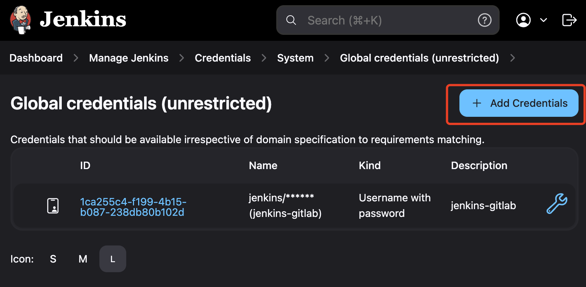
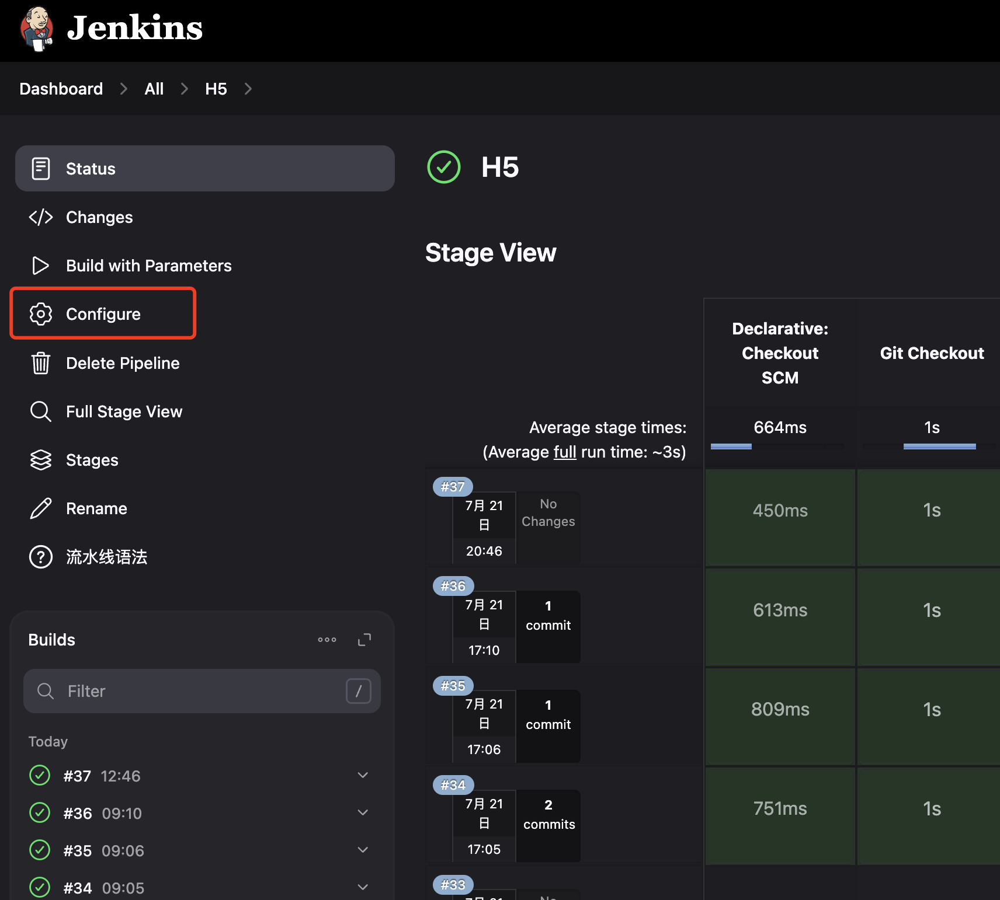
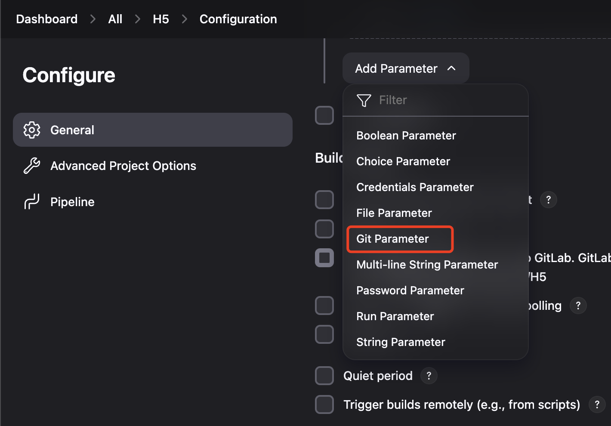

Jenkins
===

本教程展示如何在 Linux(CentOS 7) 服务器上通过 Docker 部署 Jenkins，并在 Docker 容器中运行 Pipeline 脚本。这样可以方便地使用任何版本的 Node.js 或 Java 沙盒环境。

## 部署 Jenkins

由于国内服务器无法直接拉取 Docker 镜像，需要先通过本机 VPN 下载 Jenkins 和 Jenkins agent 镜像，然后上传到服务器。

```sh
# 获取 Jenkins 镜像
docker pull --platform linux/amd64 jenkins/jenkins:2.468-jdk21
# 保存 Docker 镜像到本地文件
docker save -o jenkins-2.468-jdk21.tar jenkins/jenkins:2.468-jdk21
# 上传到服务器
scp -P 2222 jenkins-2.468-jdk21.tar root@152.22.3.186:/home/docker-images

# 获取 Jenkins agent 镜像
docker pull --platform linux/amd64 jenkins/ssh-agent:jdk21
docker save -o jenkins-ssh-agent-jdk21.tar jenkins/ssh-agent:jdk21
scp -P 2222 jenkins-ssh-agent-jdk21.tar root@152.22.3.186:/home/docker-images
```

基于 `jenkins/jenkins:2.468-jdk21` 镜像添加 Docker 支持，创建一个新的 Jenkins 镜像。以下是 `Dockerfile` 配置内容：

```Dockerfile
FROM --platform=linux/amd64 jenkins/jenkins:2.468-jdk21

# 切换到 root 用户以安装 Docker CLI
USER root

# 安装必要的软件包
RUN apt-get update && apt-get install -y \
    curl \
    gnupg2 \
    lsb-release \
    software-properties-common

# 安装 Docker CLI
# RUN curl -fsSL https://get.docker.com | sh
# 安装特定版本的 Docker CLI
RUN curl -fsSL https://download.docker.com/linux/static/stable/x86_64/docker-26.1.4.tgz | tar xzvf - --strip-components=1 -C /usr/local/bin

# 创建 docker 组并将 jenkins 用户添加到该组
RUN groupadd docker && usermod -aG docker jenkins

# 切换回 jenkins 用户
USER jenkins
```

构建 Jenkins 新的镜像，命名为 `my-jenkins-docker-2468-jdk21`

```sh
docker build --platform=linux/amd64 -t my-jenkins-docker-2468-jdk21 .
# 保存 Docker 镜像为一个 tar 文件
docker save -o my-jenkins-docker-2468-jdk21.tar my-jenkins-docker-2468-jdk21
# 通过 SCP 传输 tar 文件到远程服务器
scp -P 2222 my-jenkins-docker-2468-jdk21.tar root@152.22.3.186:/home/docker-images
```

在服务器上添加 Docker Compose 配置 `docker-compose.yml`。以下是 `docker-compose.yml` 配置内容：

```yml
# https://github.com/jenkinsci/docker/blob/master/README.md#docker-compose-with-jenkins
services:
  jenkins:
    image: my-jenkins-docker-2468-jdk21 # 自定义镜像
    #image: jenkins/jenkins:2.468-jdk21
    ports:
        - "8086:8080"
    volumes:
        # 将命名卷 jenkins_home 挂载到容器内的 /var/jenkins_home 目录，用于持久化 Jenkins 的数据。
        - jenkins_home:/var/jenkins_home
        # 将宿主机的 Docker 挂载到容器内，以便在 Jenkins 容器内直接访问 Docker 引擎，从而支持在 Jenkins 中运行 Docker 命令。
        - /var/run/docker.sock:/var/run/docker.sock
  ssh-agent:
    image: jenkins/ssh-agent:jdk21
volumes:
  jenkins_home:
```

确保与 `docker-compose.yml` 在同一个目录中。并启动 `Jenkins`:

```sh
docker compose up -d # 启动 Jenkins
docker compose down  # 停止并删除与 Docker Compose 配置文件相关的所有容器、网络、卷和镜像
```

访问 jenkins: http://152.22.3.186:8086/

## 1. 安装插件

[Git Parameter Plug-In](https://plugins.jenkins.io/git-parameter) 支持在 CI 上自动加载仓库分支


在 `Manage Jenkins` -> `System` 中设置 `Git Parameter`


## 2. 添加凭证





## 3. 新建工作流


修改配置




设置 [`Git Parameter`](https://plugins.jenkins.io/git-parameter) 可以在构建的时候读取分支，选择分支




## 3. 添加构建选项

可以在构建前选择 `生产` 还是 `开发` 模式，在脚本中判断


## 4. 选择 `Pipeline script from SCM` 指定脚本位置


这方法是将 仓库 `config` 分支添加一个 `Jenkinsfile` 配置

## Nodejs

安装 [Docker Pipeline](https://plugins.jenkins.io/git-parameter) 插件，支持从管道中构建和使用 `Docker` 容器。

```sh
docker pull --platform linux/amd64 node:14.16.0
docker pull --platform linux/amd64 node:18
docker pull --platform linux/amd64 node:20
docker pull --platform linux/amd64 node:22

# 保存 Docker 镜像到本地文件
docker save -o node14.16.tar node:14.16.0
# 上传到服务器
scp -P 2222 node14.16.tar root@152.22.3.186:/home/docker-images

docker save -o node18.tar node:18
scp -P 2222 node18.tar root@152.22.3.186:/home/docker-images

docker save -o node20.tar node:20
scp -P 2222 node20.tar root@152.22.3.186:/home/docker-images

docker save -o node22.tar node:22
scp -P 2222 node22.tar root@152.22.3.186:/home/docker-images
```

Pipeline 脚本中使用 Docker nodejs 20 运行

```groovy
pipeline {
    //agent any
    // pipeline 放到 docker 中执行
    agent {
        docker {
          // 使用 Node.js 18 的 Docker 镜像
          image 'node:20'
          // 可选：挂载 NPM 缓存目录，加速构建
          args '-v /root/.npm:/root/.npm'
        }
    }
    environment {
      def git_url="http://152.22.3.186:8081/mall/h5.git"
      def git_auth = "12312312-f199-4b15-b087-123123"
      def git_branch = "${branch}"
      def project_env = "${project_env}"
      def data_dir = "/mnt/mall/h5/h5_vip"

      // 本地需要上传的目录 以及远程服务器的目录
      def localDir = "${WORKSPACE}/h5_vip/test_dir/"
      def vip_host = '106.53.119.240'
      def vip_remote_dir = "/mnt/mall/h5"
    }
    stages {
        stage('Git Checkout'){
            steps {
                echo "🏆 WORKSPACE: 【${WORKSPACE}】"
                echo "🎯 branch: 【${git_branch}】"
                echo "🏅 project_env: 【${project_env}】"
                echo 'check git'
                checkout([
                    $class: 'GitSCM',
                    branches: [[name: "${git_branch}" ]],
                    doGenerateSubmoduleConfigurations: false,
                    extensions: [],
                    submoduleCfg: [],
                    userRemoteConfigs: [[
                    credentialsId: "${git_auth}",
                        url: "${git_url}"
                    ]]
                ])
                sh 'pwd'
                sh 'ls -la'
            }    
        }
    }
        stage('Send Files') {
            when {
                expression {
                    currentBuild.result == null || currentBuild.result == 'SUCCESS'
                }
            }
            steps {    
                sh 'pwd'
                script{                    
                    switch (project_env) {
                        case "vip":
                            sh '''
                            ls -la
                            cd h5_vip
                            npm install --registry=https://registry.npmmirror.com/
                            ls -la
                            npm run build
                            ls -la
                            rm -rf test_dir
                            mv dist test_dir
                            '''
                            withCredentials([sshUserPrivateKey(credentialsId: 'bd6f00e6-9dfd-4fd5-b94b-7559ca212e9a', keyFileVariable: 'SSH_KEY')]) {
                                // 连接到远程服务器并删除 test_dir 目录 重新上传
                                sh '''
                                ssh -i ${SSH_KEY} -o StrictHostKeyChecking=no root@106.53.119.240 "rm -rf /mnt/mall/h5/test_dir"
                                scp -i ${SSH_KEY} -o StrictHostKeyChecking=no -P 22 -r "${localDir}" root@106.53.119.240:${vip_remote_dir}
                                '''
                            }
                            break
                        case "dev":
                            // for (i in ['152.22.3.186']) {
                            //     data_dir = "/mnt/mall/h5/"
                            //     //sh "ssh $i 'cp -rf ${data_dir}/* ${data_dir}/h5_vip_{uuid_no}'"
                            //     sh "scp -r -o StrictHostKeyChecking=no -i /var/lib/jenkins/.ssh/id_rsa -P 22 '${WORKSPACE}/h5_vip/' '$i:${data_dir}'"
                            // }
                            break
                
                    }
                }
            }
        }
    }
    post {
        success {
            sh "echo 'Success success'"
        }
        
        failure {
            sh "echo 'Faild faild'"
        }
    }
}
```