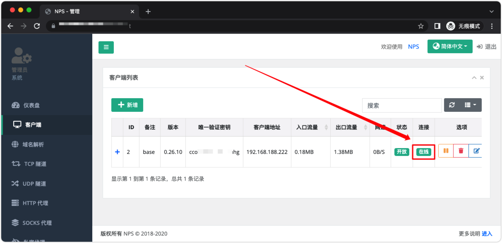
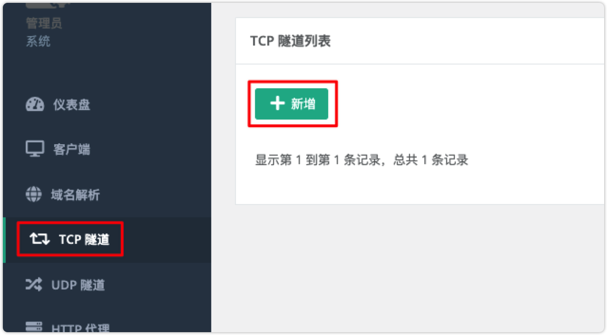
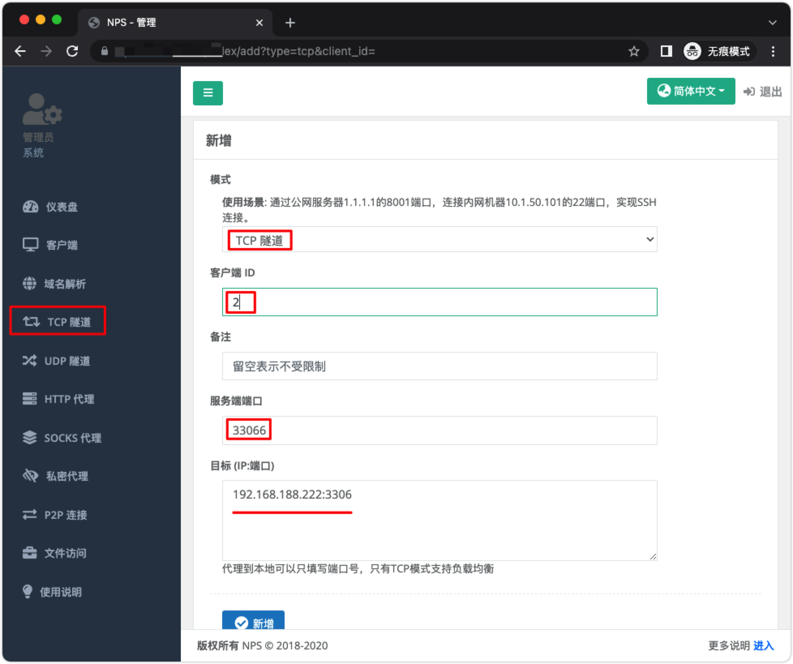
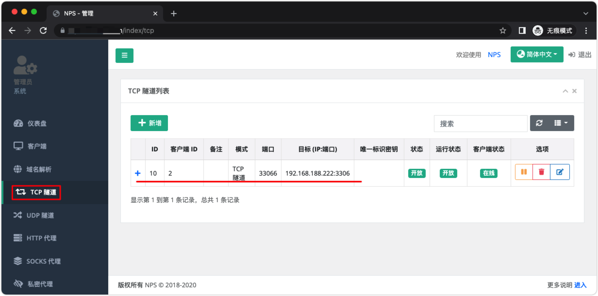
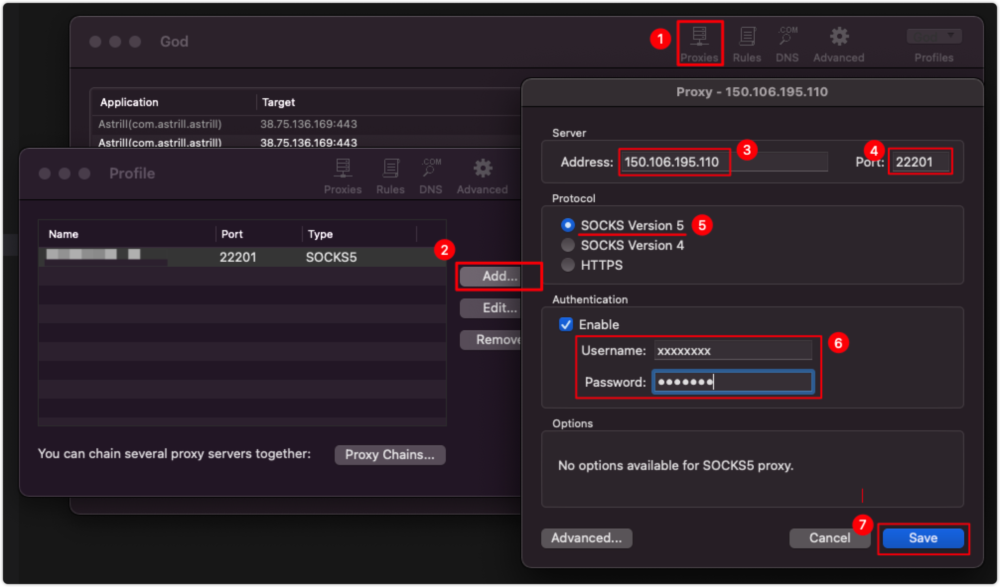

NPS
===

[nps](https://github.com/ehang-io/nps) 一款轻量级、高性能、功能强大的内网穿透代理服务器。支持tcp、udp、socks5、http等几乎所有流量转发，可用来访问内网网站、本地支付接口调试、ssh访问、远程桌面，内网dns解析、内网socks5代理等

### ① 搭建NPS服务端

服务器搭建在拥有公网 `ip=150.106.195.110` 的服务器上。下载配置 [nps/conf](https://github.com/ehang-io/nps/tree/master/conf)，将配置放在 `/opt/nps/conf` 目录下，下面我们使用 docker 部署 NPS 服务端：

```bash
# 创建 /opt/nps 目录存放配置文件
mkdir /opt/nps
# 拉取 ffdfgdfg/nps 镜像
docker pull ffdfgdfg/nps
# 运行 nps 容器，配置文件夹 conf 在 /opt/nps/conf 目录下
docker run -d --name=nps --restart=always --net=host -v /opt/nps/conf:/conf ffdfgdfg/nps
# 查看日志
docker logs nps
```

启动之后默认端口 `8080`，通过使用 `http://<你服务器IP>:8080` 访问管理界面。


使用用户名和密码登陆（默认`admin/123`，正式使用一定要更改，修改 `/opt/nps/conf/nps.conf` 配置文件中的 `web_password`），也可以在这里配置更改默认控制台管理平台端口（`web_port` = `8666`），通道端口更改 `bridge_port=8024`

记得在控制台开放端口，面板**默认端口**是 `8080`，与客户端**通信端口**是 `8024`。

### ② 添加客户端


注意：客户端命令 `./npc -server=150.106.195.110:8024 -vkey=<唯一验证密钥> -type=tcp` 中的 `唯一验证密钥` 用于客户端安装需要使用

### ③ 客户端安装使用

客户端安装在你需要穿透的内网服务器(电脑)上。

```bash
# 创建 /opt/nps 目录存放配置文件
mkdir /opt/npc
# 拉取 ffdfgdfg/nps 镜像
docker pull ffdfgdfg/npc
# 运行 npc 容器，按提示改好命令，如下图所示
# 唯一验证密钥在管理界面中获取
docker run -d --name=npc --restart=always --net=host ffdfgdfg/npc -server=<ip:port> -vkey=<web界面中显示的密钥> <以及一些其他参数>
# 示例
docker run -d --name=npc --restart=always --net=host ffdfgdfg/npc -server=150.106.195.110:8024 -vkey=<唯一验证密钥>
# 查看日志
docker logs npc
```

服务运行起来，这样客户端就连接到了 NPS 的服务端了



### ④ 建立内网穿透隧道





假设我们要穿透局域网 MySQL 数据库，在 `目标 (IP:端口)` 配置内网 MySQL IP:端口 `192.168.188.222:3306`，在外网访问的端口 `服务端端口` 配置 `33066`



配置完成之后你可以使用公网 `ip=150.106.195.110` IP 地址 和端口 `33066` 连接到你内网的机器中的数据库。

到这里就完成了，你可以自己继续研究一下更多的功能，也可以看看官方的[说明文档](https://ehang-io.github.io/nps/#/)。

### ⑤ 新建 Socks5 代理

通过 Socks5 代理可以访问内网任意服务，不必建立一个个的内网穿透隧道。在设置代理之前确保 `客户端` 建立好，并且 `链接` 状态为 `在线`。


在建立好 Socks5 代理之后，需要使用 [`proxifier`](https://www.proxifier.com/) 配置代理访问公司内网



### 相关链接

- 官网文档：https://ehang-io.github.io/nps/
- GitHub：https://github.com/ehang-io/nps
